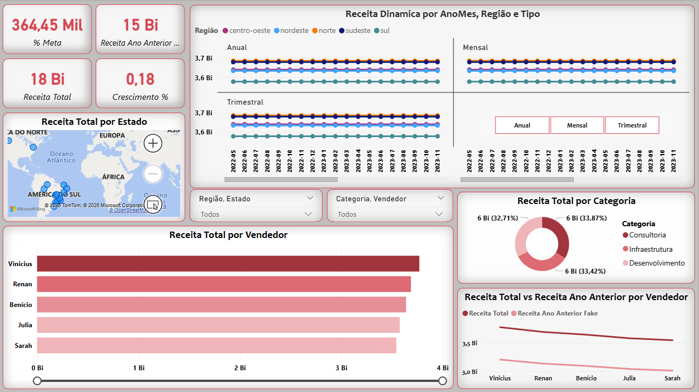

# 📊 Dashboard de Vendas - Análise Completa no Power BI



## 🚀 Visão Geral

Este projeto consiste na construção de um dashboard interativo desenvolvido no Power BI, com o objetivo de analisar o desempenho de vendas de forma estratégica, permitindo a tomada de decisão baseada em dados.

O painel foi estruturado para fornecer uma visão executiva e analítica, contemplando indicadores-chave de performance (KPIs), análise temporal, ranking de vendedores e distribuição geográfica.

---

## 🎯 Objetivos do Projeto

* Comparar desempenho atual com o ano anterior
* Avaliar o atingimento de metas por vendedor
* Identificar os principais vendedores (ranking)
* Analisar a evolução das vendas por região
* Permitir análise dinâmica por período (mensal, trimestral e anual)

---

## 📂 Estrutura dos Dados

A base de dados utilizada contém as seguintes colunas:

* ID da venda
* Data
* Vendedor
* Equipe
* Serviço
* Categoria
* Preço
* Quantidade
* Custo
* Cliente
* Estado
* Região

---

## 📊 Principais Métricas (DAX)

### Receita Total

Calculada com base no preço unitário e quantidade:

```DAX
Receita = Preço * Quantidade
```

### Lucro

```DAX
Lucro = Receita - Custo
```

### Receita Ano Anterior

```DAX
Receita Ano Anterior = 
CALCULATE(
    [Receita Total],
    SAMEPERIODLASTYEAR(Calendario[Date])
)
```

### Crescimento (%)

```DAX
Crescimento % = 
DIVIDE(
    [Receita Total] - [Receita Ano Anterior],
    [Receita Ano Anterior]
)
```

---

## 📅 Modelagem de Dados

Foi criada uma tabela calendário para permitir análises temporais:

* Ano
* Mês
* Trimestre
* Ano-Mês

Relacionamento:

* Calendario[Date] → Tabela de Vendas[Data]

---

## 🔄 Análise Dinâmica por Período

Foi implementada uma tabela desconectada para permitir a alternância entre:

* Mensal
* Trimestral
* Anual

Utilizando a função:

```DAX
SELECTEDVALUE()
```

e lógica condicional com `SWITCH()` para alterar o contexto dos cálculos.

---

## 📈 Visualizações do Dashboard

O dashboard foi estruturado em três níveis:

### 🔹 Visão Executiva (KPIs)

* Receita Total
* Receita Ano Anterior
* Crescimento %
* % de Meta

### 🔹 Análise Temporal

* Evolução da receita ao longo do tempo por região

### 🔹 Análise de Performance

* Ranking de vendedores
* Receita por categoria
* Comparação entre receita atual e ano anterior

### 🔹 Análise Geográfica

* Mapa de receita por estado

---

## 🎨 Design e Usabilidade

* Layout organizado em formato executivo
* Uso de cores para indicar desempenho (positivo/negativo)
* Filtros interativos (slicers) para:

  * Região
  * Vendedor
  * Categoria
  * Período

---

## ⚠️ Observações

Como a base de dados não possuía histórico de múltiplos anos, foi aplicada uma simulação para o cálculo de comparação com o ano anterior, permitindo demonstrar a análise de crescimento.

---

## 🛠️ Ferramentas Utilizadas

* Power BI
* DAX (Data Analysis Expressions)
* Modelagem de Dados

---

## 📌 Conclusão

Este dashboard permite uma análise completa do desempenho de vendas, possibilitando identificar tendências, oportunidades e pontos de melhoria, contribuindo para uma tomada de decisão mais estratégica e orientada por dados.

---

## 👨‍💻 Autor

Desenvolvido por Jocival Almeida.

---

## ⭐ Diferenciais do Projeto

* Uso de tabela desconectada para análise dinâmica
* Aplicação de boas práticas de modelagem
* Design voltado para tomada de decisão
* Estrutura escalável para novos dados

---
